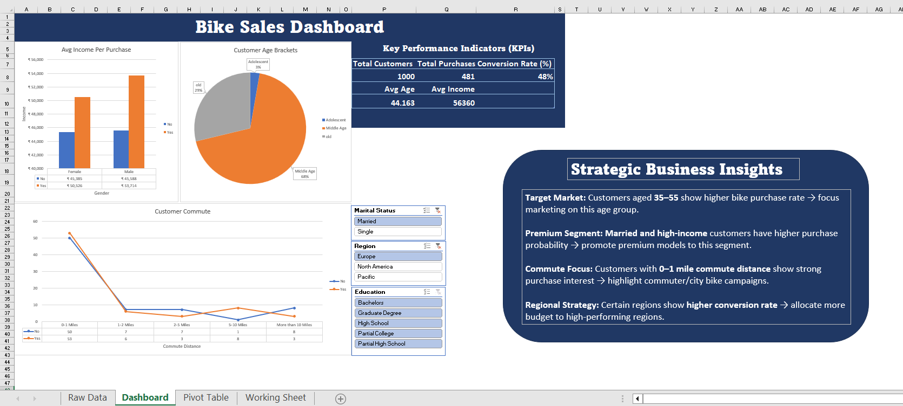

# Bike Buyers Analysis Dashboard (Excel)

## Project Overview
This project analyzes customer purchase behavior using an Excel dashboard built with Pivot Tables, Pivot Charts, and Slicers.

## Tools Used
- Microsoft Excel
- Pivot Tables
- Pivot Charts
- Slicers
- GETPIVOTDATA
- Data Cleaning & Formatting

## Key KPIs
- Total Customers
- Total Purchases
- Conversion Rate %
- Average Age
- Average Income

## Dashboard Features
- Interactive filtering using slicers
- KPI cards with GETPIVOTDATA
- Purchase analysis by:
  - Age Group
  - Income Group
  - Region
  - Commute Distance
  - Gender and Marital Status

## Business Insights
- Customers aged 35–55 show higher bike purchase rate.
- High-income and married customers have higher purchase probability.
- Short commute distance (0–1 miles) customers purchase more bikes.
- Marketing should focus on high conversion regions for better ROI.

## Dashboard Preview

